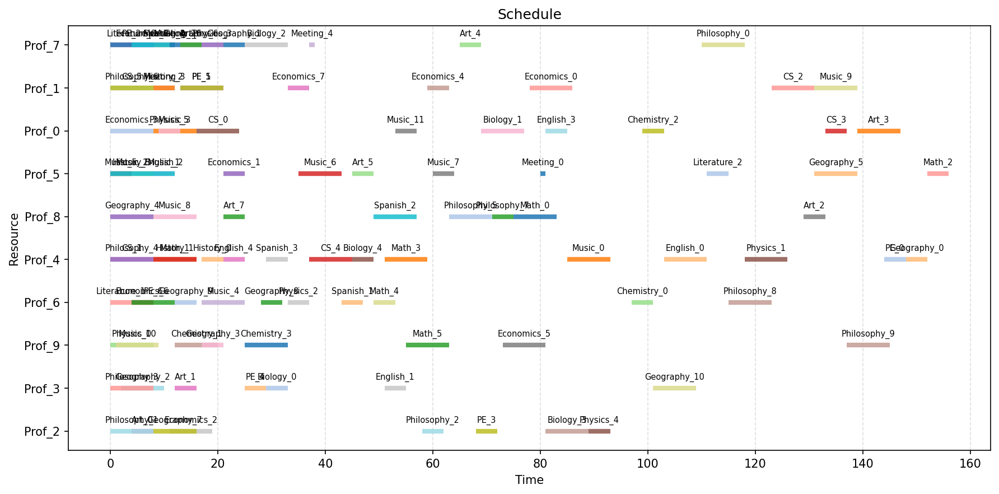

# Scheduler

A scheduling optimizer designed for the common school problem of assigning professors to classes and meetings across a weekly timetable. Given a set of tasks (classes, meetings), resources (professors), and constraints, the solver finds a feasible schedule that minimizes resource usage and time conflicts.



## Concepts

- **Tasks** are classes or meetings that need to be scheduled. A task can be *rigid* (fixed time slot) or *fluid* (the solver decides when it starts).
- **Resources** are professors. Each resource has a maximum capacity (total hours available in the time horizon).
- **Resource groups** are named sets of professors (e.g., a department). A task can be assigned to a group, optionally requiring *all* members of the group to be present (useful for meetings).
- **Assignments** link tasks to eligible resources. An assignment can be *relaxed* (the solver decides whether to use it) or *forced* (the resource must be assigned to that task).

## Input files

All input files live in a single folder. See `test/test_instance/` for a working example.

| File | Columns | Description |
|---|---|---|
| `config.toml` | `timehorizon`, `max_time`, `overlap_penalization`, `optimization_gap`, `verbose` | Solver configuration. `timehorizon` is the scheduling window length. `max_time` is the solver time limit in seconds. |
| `tasks.csv` | `task_name`, `duration`, `start`, `end`, `type` | One row per task. `type` is `rigid` or `fluid`. For rigid tasks, `start` and `end` are required. For fluid tasks, leave them empty. |
| `resources.csv` | `resource_name`, `capacity` | One row per professor. `capacity` is the max hours available. |
| `resource_groups.csv` | `resource_name`, `group_name` | Maps professors to groups. A professor can belong to multiple groups. |
| `resource_assignments.csv` | `task_name`, `resource_name`, `type` | Eligible task-resource pairs. `type` is `forced` or `relaxed`. |
| `group_assignments.csv` | `task_name`, `group_name`, `require_all_group` | Assigns tasks to groups. When `require_all_group` is `true`, every professor in the group must be assigned to the task. |


## Prerequisites

- Python 3.11+

## Install dependencies

```bash
python -m venv .venv
source .venv/bin/activate
pip install --upgrade pip
pip install -e .
pip install pytest
```

Or (if you use `pyproject.toml` optional dependencies):

```bash
pip install -e .[test]
```

## Run via code

```bash
source .venv/bin/activate
python main.py
```

## Run via cli 
```bash
python -m scheduler.cli --input-path <input-folder> --output-path <output-folder>
```

## Run tests

```bash
source .venv/bin/activate
pytest
```

## Build

```bash
source .venv/bin/activate
python -m build
```

## VS Code debugging

Use the provided `.vscode/launch.json` with:
- Python: Run main.py
- Python: Pytest

Ensure `PYTHONPATH` is `${workspaceFolder}/src` or run `export PYTHONPATH=$PWD/src`.

## Bug Report

Contact: [mattianeroni93@gmail.com](mailto:mattianeroni93@gmail.com)

## ToDo
- Introduce additional concept of task group. Forcing the scenario where, if a resource takes care of a task, it must take care of all the tasks in the group
